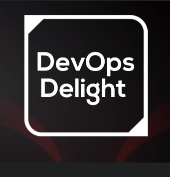

# Markdown-Tutorial
A repository to learn A-Z of Markdown language 

[list of contents](#list-of-contents)


# 🎬 Introduction

[Watch Here on youtube for demonstration](https://youtu.be/tpL3sRnbZPw)

### what is markdown 🤔? and where we use and it and how is it beneficial ? 🤔

- Markdown is a lightweight markup language that allows you to format text in a simple and readable way. It uses plain text with a few special characters to indicate formatting elements like headings, lists, and links.

### **where we use it ?**

- **Writing documentation:** Developers and technical writers use Markdown to create documentation for software, APIs, and other technical projects.   
- **Blogging and content creation:** Many blogging platforms and content management systems support Markdown, allowing writers to focus on content without worrying about complex HTML formatting.  
- **Readme files:** Markdown is the preferred format for README files on GitHub and other code repositories.  
- **Email and messaging:** Some email clients and messaging apps support Markdown, making it easier to format messages.  

### **Benefits of Markdown**

- **Easy to learn and use:** Markdown's syntax is simple and intuitive, making it easy for anyone to learn and use.  
- **Readable and maintainable:** Markdown documents are easy to read and maintain, both for humans and machines.  
- **Cross-platform compatibility:** Markdown files can be opened and edited on any platform with a text editor.  


# List of contents

[Bold and Italic](#bold-and-italic)  
[paragraph](#paragraph)  
[Lists](#lists)  
[Dropdown](#dropdown)  
[Link (Internal & external)](#linking)  
[Headings](#headings)  
[Table Creation](#table-creation)  
[Task checklist](#task-checklist)  
[Blocks](#blocks)  
[Additional Resources](#resources)  


## Bold and Italic

- To make a word/paragraph bold we have to keep it within double quotes ( ** \<world> \**)

Hightlight **hightlight**

__bold__

italic *italic*

_italic_

```
Hightlight **hightlight**

__bold__ (two underscores at the beginning and ending)

italic *italic*

_italic_
```

## paragraph

This is paragraph

  > this is paragraph
```
> This is paragraph syntax
```

## Lists

### dropdown
<details><summary>Lists are two types</summary> 1. Unordered list and <br> 2. ordered list</details>

```
To come text like above ☝️ use below syntax 👇

<details><summary>Lists are two types</summary> 1. Unordered list and <br> 2. ordered list</details>
```

### Unordered list
- linux
- git
- shell

```
- linux
- git
- shell

or 

* linux
* git
* shell
```

### ordered list

1. linux
2. git
3. shell

```
1. linux
2. git
3. shell
```

## Linking

1. Internal link (within same file)

2. External Link (outside of the file)


1. Internal link (within same file)

[Top](#list-of-contents)

Note : The place/heading which you wanted to link must have highlighted.

```
 [Top](#list-of-contents) --> this will go to the top of the web page
```

2. External link (outside same file)

[Google-homepage](https://www.google.com)

```
[Google-homepage](https://www.google.com)
```

Image link


```

```

## Headings

# heading1
## heading2
### heading3
#### heading4
##### heading5

```
# heading1
## heading2
### heading3
#### heading4
##### heading5
```

## Table creation

|SNO|NAME|
|---|---|
|1|Devops|
|2|Linux|
|3|Git|
|4|Shell|
|5|python|

```
|SNO|NAME|
|---|---|
|1|Devops|
|2|Linux|
|3|Git|
|4|Shell|
|5|python|
```

## Task checklist

- [x] markdown syntax
- [ ] linux


## Blocks

```
This is block
```

/```

This is block

/```

code syntax hightlight for a particular programming language

```python
print("welcome to the world")
```

```

```python
print("welcome to the world")
/```
```

To do inline highlight we can use `backtick`

```
To do inline highlight we can use `backtick`
```

## Miscalleneous

subscript --> h*2*0

```
subscript --> h*2*0
```

supersript --> x^2

```
supersript --> x^2
```

strikeout ~~strkeout~~

```
strikeout ~~strkeout~~
```

## Resources

[Tutorial-Markdown](https://tutorialmarkdown.com/markdown)

[Markdown Guide](https://www.markdownguide.org/)

[Emojis Cheatsheet](https://github.com/ikatyang/emoji-cheat-sheet/blob/master/README.md)


Thanks for watching till the end . we have learned markdown syntax

star it ⭐

